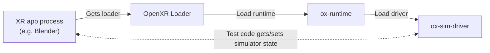
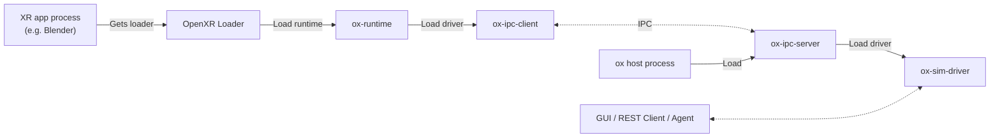

# ox

**ox** is a new lightweight and cross-platform OpenXR runtime built for automated testing.

Test OpenXR applications automatically using a virtual OpenXR device. Useful during development and CI testing.

It runs on Windows, Linux, and Mac, and supports OpenGL, Vulkan and Metal.

You can control a virtual XR device programmatically (e.g. press a button, move the headset, read screen texture etc), and integrate it with your existing test framework and code.

ox simulates Meta Quest, HTC Vive Trackers, Valve Index and other popular headsets.

> [!WARNING]
> **WORK-IN-PROGRESS** - ox is still heavily under-development and is not (yet) fully compliant with the OpenXR spec.

## Get Started

Click to use ox for:
* [Automated Testing](docs/automated_testing.md) - Use virtual XR devices inside your application and test framework. Useful for automated testing (including CI runners).
* [GUI](docs/gui.md) - Preview the headset's output and control the devices visually in a GUI window. Useful for development and live testing.
* [REST API](docs/rest_api.md) - Control the virtual XR device over HTTP. Useful for agentic development, or when you can't use the in-process API.

## News
See the [releases](https://github.com/ox-runtime/ox/releases) page for fine-grained release notes.

- 30-Jun-2026: 🔥 released a regression test suite for Blender's XR API. [[more...](https://github.com/cmdr2/blender-xr-regression-tests)]
- 21-May-2026: 🔥 ox now has a Python wrapper for easier in-process testing. [[more...](docs/automated_testing.md#testing-with-python)]
- 09-Apr-2026: 🔥 ox now supports XR testing fully within the application process (i.e. no IPC). Also releases a re-designed GUI, and additional release formats: dmg, Windows Installer, AppImage, flatpak and snap.
- 10-Mar-2026: 🔥 ox now supports Metal, and live preview in the Simulator GUI window.
- 31-Jan-2026: 🔥 ox now supports Vulkan (versions 1.0 to 1.3).
- 28-Jan-2026: 🔥 First public version of ox released, with a simulator GUI and REST API. Supports OpenGL on Windows, Linux and macOS.

## Design
### Single-Process Mode
* **Used for:** Automated Testing
* **Process:** XR app process (e.g. Blender) loads the XR driver directly

### Split-Process Mode:
* **Used for:** GUI and REST API
* **Process 1:** XR app process (e.g. Blender)
* **Process 2:** [ox](https://github.com/ox-runtime/ox) host process, loads the XR driver
* **Communication channel:** IPC

## [Development](docs/development.md)

## [Documentation](docs/README.md)

## [FAQ](docs/faq.md)

## References

- [OpenXR Specification](https://www.khronos.org/registry/OpenXR/)
- [OpenXR SDK](https://github.com/KhronosGroup/OpenXR-SDK)
- [OpenXR Loader Design](https://github.com/KhronosGroup/OpenXR-SDK-Source/blob/main/src/loader/LoaderDesign.md)
