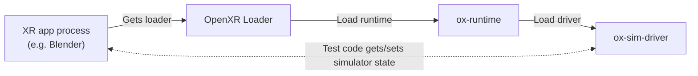
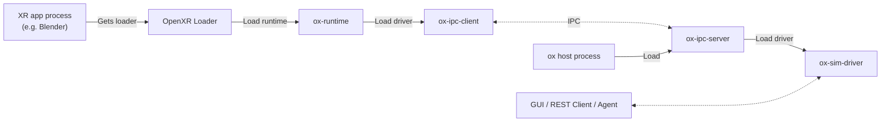

# Development

## Code

The code is organized into the following repositories:
- [ox](https://github.com/ox-runtime/ox) (this repo): bundles the core sub-repos into a single build.
- [ox-sim-driver](https://github.com/ox-runtime/ox-sim-driver): the simulator GUI, REST API, and C API (plus langauge wrappers) for controlling the virtual device programmatically.
- [ox-runtime](https://github.com/ox-runtime/ox-runtime): the OpenXR runtime implementation.
- [ox-ipc-proxy](https://github.com/ox-runtime/ox-ipc-proxy): proxies driver calls over IPC. decouples the application process from the XR device driver. Used by the GUI and REST API.

## Design
### Single-Process Mode
* **Used for:** Automated Testing
* **Process:** XR app process (e.g. Blender) loads the XR driver directly



### Split-Process Mode:
* **Used for:** GUI and REST API
* **Process 1:** XR app process (e.g. Blender)
* **Process 2:** [ox](https://github.com/ox-runtime/ox) host process, loads the XR driver
* **Communication channel:** IPC



## Build
1. (Linux-only) Install platform dependencies:

```bash
# Ubuntu / Debian
sudo apt-get update
sudo apt-get install -y libgl1-mesa-dev libxcb-dev libx11-dev libxrandr-dev libxinerama-dev libxcursor-dev libxi-dev libpng-dev pkg-config
```
2. Configure and build:

```bash
cmake -B build
cmake --build build --config Release
```

The build will be produced in `./build/bin/`.

### Working with local checkouts
By default, the top-level CMake build fetches the sub-project repos with `FetchContent`. To work against local repo clones instead, pass any of these build-time flags:

- `OX_RUNTIME_REPO`
- `OX_IPC_PROXY_REPO`
- `OX_SIM_DRIVER_REPO`

For e.g. to build against local clones of all three repos:

```bash
cmake -B build \
	-DOX_RUNTIME_REPO=/path/to/ox-runtime \
	-DOX_IPC_PROXY_REPO=/path/to/ox-ipc-proxy \
	-DOX_SIM_DRIVER_REPO=/path/to/ox-sim-driver
cmake --build build --target ox --config Release
```
